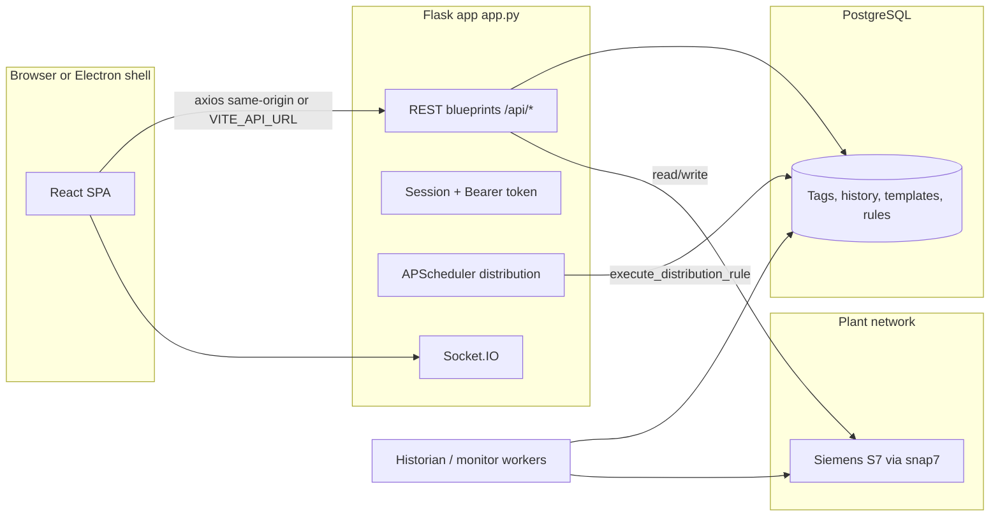

# Hercules Reporting Module — Full System Documentation

**Product:** Industrial reporting, live PLC monitoring, dashboards, scheduled distribution, and AI-assisted analysis.  
**Stack (this repo):** Flask + eventlet + PostgreSQL + Socket.IO (backend); React + Vite + MUI + Tailwind (frontend); optional Electron desktop shell (see `desktop/`, `CLAUDE.md`).  
**Document generated from:** Source inspection of branch workspace (May 2026). If behavior differs on another branch, reconcile with that branch’s code.

---

## Table of Contents

1. [System Overview](#1-system-overview)  
2. [Architecture Overview](#2-architecture-overview)  
3. [Navigation, Roles, and Routes](#3-navigation-roles-and-routes)  
4. [Tab-wise Features](#4-tab-wise-features)  
5. [Complete Feature List](#5-complete-feature-list)  
6. [PLC / Protocol Documentation](#6-plc--protocol-documentation)  
7. [Tag Configuration Guide](#7-tag-configuration-guide)  
8. [Report Builder Guide](#8-report-builder-guide)  
9. [Dashboard Report Guide](#9-dashboard-report-guide)  
10. [Table Report Guide](#10-table-report-guide)  
11. [Distribution Guide](#11-distribution-guide)  
12. [Hercules AI Guide](#12-hercules-ai-guide)  
13. [Engineering Page Guide](#13-engineering-page-guide)  
14. [App Settings, PLC, and System Logs](#14-app-settings-plc-and-system-logs)  
15. [Profile and User Management](#15-profile-and-user-management)  
16. [Backend Technical Documentation](#16-backend-technical-documentation)  
17. [Frontend Technical Documentation](#17-frontend-technical-documentation)  
18. [Database Documentation](#18-database-documentation)  
19. [Deployment and Update Guide](#19-deployment-and-update-guide)  
20. [Changelog Documentation Process](#20-changelog-documentation-process)  
21. [How to Update This Documentation When New Features Are Added](#21-how-to-update-this-documentation-when-new-features-are-added)  
22. [Industrial Use Cases](#22-industrial-use-cases)  
23. [Gaps and Partial Implementations](#23-gaps-and-partial-implementations)  
24. [Conclusion](#24-conclusion)

---

## 1. System Overview

### 1.1 What the system is

Hercules (Reporting Module) is a **plant-floor data and reporting application**: it connects to a **Siemens S7 PLC** over the network, reads configured **tags** (DB addresses), exposes **live values** to browsers (HTTP + WebSocket), stores **time-series history** in PostgreSQL, and lets engineers build **dashboard-style** and **paginated table** reports. It can **email or save** generated reports on a schedule, and includes **Hercules AI** for tag profiling, optional narrative summaries, and related analytics endpoints.

### 1.2 Problems it solves

- **Visibility:** Operators see live weights, states, counters, and KPI-style values without opening the SCADA station.  
- **Traceability:** Historical values support shift reports, audits, and troubleshooting.  
- **Consistency:** Report definitions live in the database; released reports are viewed in dedicated viewers.  
- **Delivery:** Distribution rules automate PDF/XLSX/HTML generation and email (or folder save where configured).  
- **Engineering efficiency:** Bulk tag import (CSV/Excel), mappings (code → text), tag groups, and report builder tooling reduce manual Excel work.

### 1.3 Main use cases (mapped to product areas)

| Use case | Where in the app | Primary persistence |
|----------|------------------|----------------------|
| PLC live data monitoring | Live Monitor routes (`/live-monitor/*`), Digital Twin (uses live tag API) | `tags`, `live_monitor_*`, Socket.IO + REST |
| Historical reporting | Historian API + report viewers + Job Logs | `tag_history`, `tag_history_archive` |
| Table reports | Report Builder paginated editor + `/reports` viewer | `report_builder_templates.layout_config` |
| Dashboard reports | Report Builder canvas + `/dashboards` viewer | Same table, different `layout_config` shape |
| Report builder | `/report-builder` | `report_builder_templates` |
| Report distribution | `/distribution` + scheduler | `distribution_rules` |
| Engineering configuration | `/settings/*` | Tags, groups, mappings, DB tables + some localStorage (see §13) |
| Hercules AI analysis | `/hercules-ai`, `/hercules-ai/settings` | `hercules_ai_*` tables + config JSON |
| User / settings management | `/profile`, `/profile/users`, `/app-settings` | `users`, `system_settings`, files under `config/` |

---

## 2. Architecture Overview



- **Backend entry:** `backend/app.py` — registers blueprints, CORS rules, static SPA, login routes, and starts background pieces (see repo for exact startup).  
- **Real-time:** `flask_socketio` with `eventlet` async mode; live tag pushes use Socket.IO (see live monitor / digital twin code).  
- **Historian:** Central worker writes to `tag_history` (see `backend/workers/historian_worker.py` and `USE_CENTRAL_HISTORIAN`).  
- **Distribution:** `backend/scheduler.py` loads `distribution_rules` and runs `distribution_engine.execute_distribution_rule`.

---

## 3. Navigation, Roles, and Routes

### 3.1 Roles

Defined in `Frontend/src/Data/Roles.js`:

- `superadmin` — sees all sidebar items (sidebar logic bypasses role filter for superadmin).  
- `admin` — full configuration including Hercules AI (per routes).  
- `manager` — builder, engineering, distribution; not Hercules AI routes.  
- `operator` — dashboards, table reports, job logs, digital twin, atlas pages; **no** report builder, engineering, or distribution.

Default after login: **Operators** go to `/reports`; others go to `/report-builder` (`AppRoutes.jsx` `DefaultRedirect`).

### 3.2 Main sidebar (`Frontend/src/Data/Navbar.js` + `SideNav.jsx`)

| Sidebar label (i18n key) | Path | Roles |
|---------------------------|------|--------|
| Builder | `/report-builder` | admin, manager |
| Digital Twin | `/digital-twin` | admin, manager, operator |
| Dashboards | `/dashboards` | all four roles above |
| Table Reports | `/reports` | all |
| Job Logs | `/job-logs` | all |
| Distribution | `/distribution` | admin, manager |
| Hercules AI | `/hercules-ai` | admin only |
| Hercules Atlas | `/atlas` | all |
| Atlas AI | `/atlas-ai` | all |
| Engineering | `/settings` | superadmin, admin, manager |
| Profile (footer) | `/profile` | all authenticated |
| Settings (footer) | `/app-settings` | superadmin, admin |

### 3.3 Routes not in the main sidebar

These exist in `Frontend/src/Routes/AppRoutes.jsx` but **are not** entries in `getMenuItems`:

| Path | Purpose |
|------|---------|
| `/reporting` and `/reporting/:id` | **Grid / “reporting”** viewer (`ReportViewer`) for widget-style templates |
| `/live-monitor/dynamic` | Live monitor runtime view |
| `/live-monitor/layouts` | Layout list / management |
| `/live-monitor/layouts-manager` | Alternate layout manager UI |
| `/live-monitor/layouts/:id` … | Section editors (table, KPI, chart) |
| `/report-builder/:id/preview` | Preview |
| `/report-builder/:id/paginated` | Paginated (table) designer |
| `/hercules-ai/settings` | AI settings sub-route |
| `/profile/users` | User management (nested under profile) |
| `/app-settings/logs`, `/licenses`, `/updates` | App settings tabs |

**Industrial note:** Bookmark `/live-monitor/dynamic` for control-room screens; train users that the entry is not in the left rail by default.

---

## 4. Tab-wise Features

For each area: **purpose**, **features**, **user actions**, **key APIs**, **tables**, **main components**, **use case**.

### 4.1 Login (`/login`)

- **Purpose:** Authenticate against `users` table; receive `user_data` including `auth_token`.  
- **Features:** Form validation (Formik + Yup).  
- **API:** `POST /login` (not under `/api/`). Token stored in `localStorage` key from `Frontend/src/API/axios.js`.  
- **Components:** `Frontend/src/Pages/Login.jsx`.  
- **Use case:** Shift handover; shared PC with individual logins.

### 4.2 Report Builder Manager (`/report-builder`)

- **Purpose:** List, create, duplicate, delete templates; open canvas or paginated designer.  
- **API:** `GET/POST /api/report-builder/templates`, `DELETE/PUT/GET .../templates/:id`, `POST .../duplicate`, `GET .../export`.  
- **Tables:** `report_builder_templates`.  
- **Components:** `ReportBuilderManager.jsx`.  
- **Use case:** Engineer builds production report templates once; operators consume released reports.

### 4.3 Report Builder Canvas (`/report-builder/:id`)

- **Purpose:** Drag-and-drop **dashboard** layout (widgets, grid).  
- **API:** Template CRUD; live data via `GET /api/live-monitor/tags` (used in canvas/preview).  
- **Components:** `ReportBuilderCanvas.jsx`, widgets under `Frontend/src/Pages/ReportBuilder/widgets/`.  
- **Use case:** Shift dashboard with gauges, charts, tables.

### 4.4 Paginated Report Builder (`/report-builder/:id/paginated`)

- **Purpose:** A4-style **table report** with per-cell tag + aggregation.  
- **API:** Same template endpoints; historian `GET /api/historian/by-tags` for preview.  
- **Components:** `PaginatedReportBuilder.jsx`.  
- **Use case:** Totalizer / batch weight reports with Δ, first, last per cell.

### 4.5 Report Builder Preview (`/report-builder/:id/preview`)

- **Purpose:** Preview template with live or sample data.  
- **API:** `/api/live-monitor/tags`, historian as needed.  
- **Components:** `ReportBuilderPreview.jsx`.

### 4.6 Reporting (grid viewer) (`/reporting`, `/reporting/:id`)

- **Purpose:** View **released** widget/grid templates as read-only reporting screens.  
- **API:** Report builder templates list + live/historian APIs (see `ReportViewer.jsx`).  
- **Components:** `ReportViewer.jsx`, `DashboardViewer` / table viewers re-exported from same module boundary per routes file.  
- **Use case:** Management overview pages.  
- **Note:** Not linked in sidebar — users need a bookmark or internal link.

### 4.7 Dashboards viewer (`/dashboards`, `/dashboards/:id`)

- **Purpose:** Operator-facing **released** templates whose `layout_config.reportType` is **not** `paginated` (default / dashboard-style).  
- **API:** Templates + `/api/live-monitor/tags` + historian.  
- **Components:** `DashboardViewer` in `ReportViewer.jsx` (filters `status === 'released'`).  
- **Use case:** Control-room wallboard.

### 4.8 Table reports viewer (`/reports`, `/reports/:id`)

- **Purpose:** **Released** templates with `layout_config.reportType === 'paginated'`; date range; export.  
- **API:** Historian `by-tags`, `row-segments`; live tags for “live” mode.  
- **Components:** `PaginatedReportViewer.jsx`, `exportReport.js` (PDF, PNG, Excel path per UI).  
- **Use case:** Daily production sheet replacing paper forms.

### 4.9 Job Logs (`/job-logs`)

- **Purpose:** Order-based production history tied to templates with order fields.  
- **API:** `GET /api/orders/layouts`, `GET /api/orders/jobs`, `GET /api/orders/jobs/:id`, `GET /api/orders/layout-tags/:templateId`, `GET /api/report-builder/templates/:id`, `GET /api/historian/by-tags`, `POST /api/historian/row-segments`.  
- **Tables:** `dynamic_orders`, `dynamic_order_counters`, `report_builder_templates` (order columns), historian tables.  
- **Components:** `JobLogsPage.jsx`.  
- **Use case:** Traceability per batch/order ID.

### 4.10 Distribution (`/distribution`)

- **Purpose:** Create/edit/run **distribution rules** (schedule, recipients, format).  
- **API:** `GET/POST /api/distribution/rules`, `PUT/DELETE .../rules/:id`, `POST .../run`, `GET .../browse-folders`, `GET .../log`.  
- **Tables:** `distribution_rules`.  
- **Components:** `DistributionPage.jsx`.  
- **Use case:** Automated morning PDF to production manager.

### 4.11 Hercules AI (`/hercules-ai`, `/hercules-ai/settings`)

- **Purpose:** Scan tags, review profiles, configure cloud/local LLM, previews, advanced endpoints (forecasts, anomalies, savings, etc.).  
- **API:** See §16.7.  
- **Tables:** `hercules_ai_tag_profiles`, `hercules_ai_config`.  
- **Components:** `HerculesAISetup.jsx`, `SettingsPage.jsx` (under Hercules AI).  
- **Use case:** Prioritize which signals matter; optional AI blurb in distribution emails (engine supports this — see `distribution_engine.py`).

### 4.12 Hercules Atlas (`/atlas`)

- **Purpose:** “Mill board” style UI for production / energy storytelling.  
- **Data source in code:** **Mock snapshot** (`mockSnapshot`); file header states Phase 2 would use e.g. `GET /api/hercules-ai/mill-b-snapshot` — **that endpoint is not present** in `hercules_ai_bp.py` route list inspected.  
- **Status:** **Partially implemented** (UI + mock data).

### 4.13 Atlas AI (`/atlas-ai`)

- **Purpose:** Three-tab “Production / PdM / Yield” experience.  
- **Data source:** No `axios` usage found under `Frontend/src/Pages/AtlasAI/tabs` in repo scan — treat as **UI shell / demo-level** unless extended locally.  
- **Status:** **Partially implemented** — needs confirmation from code owner for live data wiring.

### 4.14 Digital Twin (`/digital-twin`)

- **Purpose:** 3D plant view with live tag fallback.  
- **API:** Socket.IO + `GET /api/live-monitor/tags` every 3s when disconnected (see file header in `DigitalTwinPage.jsx`).  
- **Use case:** Spatial context for alarms or status.

### 4.15 Live Monitor — Dynamic (`/live-monitor/dynamic`)

- **Purpose:** Run published live monitor **layouts** (tables, KPIs, charts).  
- **API:** `GET /api/live-monitor/layouts`, `GET .../layouts/:id`, `GET /api/live-monitor/tags`, `GET /api/live-monitor/predefined`.  
- **Tables:** `live_monitor_layouts`, `live_monitor_sections`, `live_monitor_columns`, `live_monitor_table_config`, `live_monitor_kpi_config`, `tag_groups`, etc.  
- **Components:** `DynamicLiveMonitor.jsx`.  
- **Use case:** Operator SCADA-lite screen.

### 4.16 Live Monitor — Layout editors (`/live-monitor/layouts*`, sections, KPI, chart)

- **Purpose:** Author layouts and sections.  
- **API:** Full CRUD under `/api/live-monitor/...` (see §16.3).  
- **Components:** `LiveMonitorLayoutManager.jsx`, `LayoutManager.jsx`, section editors in `Layouts/Sections/`.

### 4.17 Engineering (`/settings/*`)

Sub-tabs from `SettingsHome.jsx`:

| Tab | Path | Purpose |
|-----|------|---------|
| Tags | `/settings/tags` | CRUD tags, import/export |
| Tag groups | `/settings/tag-groups` | Organize tags |
| Formulas | `/settings/formulas` | Saved formula **library** (localStorage — see §13) |
| Mappings | `/settings/mappings` | Value lookup mappings |
| Email / SMTP | `/settings/distribution` | **Not** the same as `/distribution` — this is `ReportDistribution` for SMTP-related settings UI |
| Shifts | `/settings/shifts` | Shift configuration |
| Export / Import | `/settings/export-import` | Bundled export/import |
| Branding | `/settings/branding` | Client logo |

### 4.18 App settings (`/app-settings`)

| Tab | Path | Purpose |
|-----|------|---------|
| System | `/app-settings` | Demo mode, **PLC IP/rack/slot**, retention, version, network link |
| Logs | `/app-settings/logs` | System log stream |
| Licenses | `/app-settings/licenses` | superadmin only |
| Updates | `/app-settings/updates` | Software update check |

### 4.19 Profile (`/profile`)

- **My Account:** password change, profile UI.  
- **Users:** `UserManagement.jsx` — `GET /users`, `POST /add-user`, etc. (routes **without** `/api` prefix).

---

## 5. Complete Feature List

**Connectivity**

- Single **Siemens S7** connection via **python-snap7** (`plc_utils.py`); shared client with reconnect cooldown.  
- **Demo mode** uses emulator path (`connect_to_plc_fast()` behavior — see `plc_utils.py` remainder).  
- **No Modbus / OPC UA** code in `backend/` on this branch (grep found no matches).

**Tags and data**

- Tag CRUD; sources: PLC, Formula, Mapping, Manual (`tags` table).  
- PLC addressing: DB number, byte offset, data types BOOL/INT/DINT/REAL/STRING/WSTRING, bit position, byte swap, scaling, units, decimals.  
- Bulk CSV/JSON/Excel import (`tags_bp` routes).  
- Historian: `tag_history` / archive; API aggregations: last, first, avg, min, max, sum, delta, count, auto (`historian_bp.py`).  
- Tag value cache + workers for efficient reads (see workers package).

**Live monitoring**

- Published layouts; Socket.IO for push; REST fallback in several pages.

**Reports**

- Grid/canvas reports and paginated reports stored as JSON in `report_builder_templates.layout_config`.  
- Template lifecycle `status`: `draft` → `released` (legacy `published`/`validated` mapped in `_ensure_table()`).  
- **Exports (UI):** PDF/PNG via `jspdf` / `html-to-image` (`exportReport.js`); Excel export actions exist on table/grid viewers (see `PaginatedReportViewer.jsx`, `ReportViewer.jsx`).  
- **Print** support where implemented in viewers.

**Distribution**

- Rules: email and optional save path; formats **pdf**, **html**, **xlsx** (`distribution_engine.py`).  
- Scheduler: daily / weekly / monthly cron-style triggers.  
- Manual run: `POST /api/distribution/rules/:id/run`.

**AI**

- Dual provider: **Anthropic Claude** (cloud) or **LM Studio** OpenAI-compatible (local) — `ai_provider.py`.  
- Tag scan, profiles, config, preview summary, charts, many operational endpoints (see §16.7).

**Users and security**

- Flask-Login session + **Bearer** `auth_token` for cross-origin.  
- Role-gated routes on frontend; backend uses `@login_required` and `@require_role` on user management.

**Internationalization**

- English, Arabic, Hindi, Urdu — `Frontend/src/i18n/*.json`.

---

## 6. PLC / Protocol Documentation

### 6.1 Supported protocol (this branch)

| Protocol | Library | Notes |
|----------|---------|--------|
| **Siemens S7** (ISO-on-TCP) | **python-snap7** | Primary industrial integration |

**Not implemented in this codebase (confirmed by search):** Modbus TCP, OPC UA drivers.

> **Note (repo documentation):** `CLAUDE.md` mentions multi-protocol work on a **feature branch** — that is not merged into the inspected `backend/` tree.

### 6.2 Connection parameters

| Field | Storage / usage |
|-------|-------------------|
| **IP** | `config/plc_config.json` via `plc_config.py` |
| **Rack** | same |
| **Slot** | same |
| **TCP port** | S7 standard **102** — used by snap7 internally (not a separate JSON field) |

Defaults when file missing: from `plc_config._DEFAULTS` (e.g. `192.168.23.11`, rack `0`, slot `3`).

### 6.3 How connection is configured

1. **UI:** `App Settings` → System (`SystemSettings.jsx`): IP, rack, slot; uses `useSystemStatus()` → `POST /api/settings/plc-config`.  
2. **File:** `backend/config/plc_config.json` (path via `config_paths.get_config_dir()`).  
3. **Reconnect:** `set_plc_config_route` in `app.py` calls `reconnect_shared_plc()` from `plc_utils.py`.

### 6.4 Timeouts and errors

From `plc_utils.py` (head of file):

- Connect timeout ~2000 ms, recv/send ~1500 ms.  
- **Reconnect cooldown:** 10 seconds after failure to avoid hammering the PLC.  
- `mark_disconnected()` on read failures; subsequent reads trigger reconnect path.

### 6.5 How live data is read

- Workers and API layers use `connect_to_plc_fast()` / shared client to read DB areas per tag metadata (`tags.db_number`, `tags.offset`, etc.).  
- Live API: `GET /api/live-monitor/tags` aggregates configured tags for the monitor UI.  
- Socket.IO pushes updates from the dynamic monitor worker (see `workers/dynamic_monitor_worker.py`).

### 6.6 How tag values are stored

- **Historian:** `tag_history` at ~1 Hz for active PLC tags (subject to `USE_CENTRAL_HISTORIAN` and cache — see `historian_worker.py`).  
- **Quality:** `quality_code` column supports GOOD/BAD/STALE/COMM_ERROR.  
- **Archive:** `tag_history_archive` for rolled-up / long-range reporting.

### 6.7 How to test PLC connectivity

- **From UI:** System settings page after saving PLC IP (if a test button is exposed in your build — tag-level test: `GET /api/tags/<tag_name>/test` exists in `tags_bp.py`).  
- **From engineering:** Create a BOOL/INT tag pointing at a known address and watch **Live Monitor** or tag test endpoint.

### 6.8 How to add a new PLC/device

**Needs confirmation from code owner:** The codebase models a **single shared S7 connection** (one IP/rack/slot). There is **no** per-device table for multiple PLCs in the inspected `plc_config` / `SharedPLCConnection` design. Multi-PLC would be a product extension.

### 6.9 How live PLC data appears

1. Engineer sets PLC IP/rack/slot.  
2. Engineer defines **tags** with DB addresses.  
3. Live monitor layout or report/dashboard consumes tag names.  
4. Browser receives values over Socket.IO and/or polling endpoints.

---

## 7. Tag Configuration Guide

### 7.1 Adding tags

- **UI:** `/settings/tags` — `TagManager.jsx`.  
- **Import:** CSV, JSON, or Excel via `/api/tags/import-plc-csv`, `/api/tags/import-plc-excel`, bulk import routes.  
- **Table:** `tags`.

### 7.2 Fields (PLC source)

| Concept | Column / behavior |
|---------|-------------------|
| Identity | `tag_name` (unique), `display_name` |
| Address | `db_number`, `offset` (byte), `bit_position` for BOOL |
| Type | `data_type` |
| String length | `string_length` for STRING/WSTRING |
| Endianness | `byte_swap` for REAL |
| Scaling | `scaling` multiplier |
| Display | `unit`, `decimal_places`, `description` |
| Counter behavior | `is_counter` (used in historian delta logic) |

### 7.3 Formula / mapping / manual

- `source_type`: PLC | Formula | Mapping | Manual — see migration `create_tags_tables.sql` CHECK constraints.  
- Formula text in `formula`; mapping reference in `mapping_name`.

---

## 8. Report Builder Guide

1. Open **Builder** from sidebar (`/report-builder`).  
2. Create a template → opens **Canvas** at `/report-builder/:id`.  
3. Drag widgets; bind tags; use properties panel (`panels/PropertiesPanel.jsx` and related).  
4. Save: autosave via hooks (see `useReportCanvas` in repo).  
5. Set template **status** to **released** when ready for operators (exact control is in manager UI — inspect `ReportBuilderManager` / template actions).  
6. **Paginated** variant: open `/report-builder/:id/paginated` for A4 table design.

**API:** §16.4.

---

## 9. Dashboard Report Guide

- **Design:** Same `report_builder_templates` row; `layout_config` holds grid/widgets (charts, gauges, tables).  
- **Consume:** `/dashboards` lists templates where `layout_config.reportType` is **not** `paginated` (see `getReportType()` / `DashboardViewer` in `ReportViewer.jsx`) and `status === 'released'`.  
- **Exports:** PDF multi-canvas, PNG, Excel per `ReportViewer.jsx` / `exportReport.js`.

---

## 10. Table Report Guide

- **Design:** Paginated builder (`PaginatedReportBuilder.jsx`); per-cell aggregation (last, first, delta, avg, etc.); sets `layout_config.reportType` to **`paginated`**.  
- **Consume:** `/reports` (same `reportType === 'paginated'` + `released` filter in `TableReportViewer`).  
- **Historian:** `collectPaginatedTagAggregations` pattern (frontend) + `/api/historian/by-tags` with aggregation query param.  
- **Exports:** PDF + Excel buttons in `PaginatedReportViewer.jsx`.

---

## 11. Distribution Guide

### 11.1 Concepts

- A **rule** selects report template(s), schedule, recipients, optional disk path, output **format** (`pdf` | `html` | `xlsx`).  
- Engine builds HTML and converts with **xhtml2pdf** (`pisa`) for PDF; openpyxl-style path for XLSX (see `generate_report_xlsx` in `distribution_engine.py`).

### 11.2 APIs

§16.5.

### 11.3 Scheduler

- `scheduler.rebuild_scheduler_jobs()` after CRUD (called from `distribution_bp` after changes).  
- Uses APScheduler `CronTrigger`.

### 11.4 SMTP

- Resend + SMTP settings under `/api/settings/smtp-config` and test route `smtp-test` in `app.py`.

---

## 12. Hercules AI Guide

1. **Admin** opens `/hercules-ai`.  
2. Configure provider in **settings** (`/hercules-ai/settings` or embedded flow — follow UI).  
3. **Scan** tags → creates/updates **profiles**.  
4. Review classifications; adjust profiles via PUT endpoints.  
5. Optional: preview summary / charts; connect distribution **AI summary** if enabled in your deployment.

**Providers:** `ai_provider.generate()` — cloud uses `anthropic` SDK; local uses `openai` SDK against LM Studio base URL from config.

---

## 13. Engineering Page Guide

| Area | Backend | Storage note |
|------|---------|----------------|
| Tags | `tags_bp` | PostgreSQL |
| Tag groups | `tag_groups_bp` | PostgreSQL |
| **Formulas** | *No dedicated REST in scan* | **`localStorage` key `system_saved_formulas`** (`FormulaManager.jsx`) |
| Mappings | `mappings_bp` | `mappings` table |
| Export/Import | `ExportImport.jsx` | Mix of API + `localStorage` for report configs (see file comments in repo) |
| Shifts | `/api/settings/shifts` | Persisted via app settings handlers (inspect `app.py` implementation) |
| Branding | `branding_bp` | `system_settings` key `client_logo` |

---

## 14. App Settings, PLC, and System Logs

- **PLC:** §6.  
- **Demo mode:** `GET/POST /api/settings/demo-mode`.  
- **Data retention:** `GET/POST /api/settings/data-retention`; export archive `GET /api/settings/export-archive`.  
- **Logs:** Ring buffer + `GET /api/settings/logs/recent`; file logs `GET /api/settings/system-logs`; Socket.IO namespace `/logs`.  
- **Updates:** `GET /api/settings/version`, `GET /api/settings/updates/check` (`updates_bp`).  
- **Network URL:** `GET /api/settings/network-info` for sharing portal link.

---

## 15. Profile and User Management

- **Profile:** `/profile` — account settings, `POST /change-own-password`.  
- **Users:** `/profile/users` — admin-only backend: `POST /add-user`, `PUT /update-user/:id`, `DELETE /delete-user/:id`, `POST /change-password/:id`, `GET /users`.  
- **Roles enforced on update:** `admin`, `manager`, `operator` (see `update_user` in `app.py`); superadmin exists in DB but add-user path may restrict — verify when creating superadmin users.

---

## 16. Backend Technical Documentation

### 16.1 Project structure (high level)

```
backend/
  app.py                 # Flask app, auth, many /api/settings/* routes, SPA static
  *_bp.py                # Blueprints (tags, historian, report builder, …)
  plc_utils.py           # snap7 shared client
  plc_config.py          # JSON PLC settings
  distribution_engine.py # Report generation + email
  scheduler.py           # Distribution cron jobs
  workers/               # Historian, dynamic monitor, archive, …
  migrations/            # SQL migrations
  ai_provider.py         # LLM abstraction
  smtp_config.py         # Email (do not commit secrets)
  config/                # Runtime JSON (plc, db, …)
```

### 16.2 Framework

- **Flask** + **Flask-Login** + **Flask-SocketIO** + **eventlet** + **psycopg2** (pool).

### 16.3 API summary — Live monitor (`live_monitor_bp`, prefix `/api`)

- `GET /live-monitor/predefined`  
- `GET /live-monitor/tags`  
- `GET|POST /live-monitor/layouts`  
- `GET|PUT|DELETE /live-monitor/layouts/:id`  
- `POST /live-monitor/layouts/:id/sections`  
- `POST /live-monitor/sections/:id/columns`  
- `POST /live-monitor/sections/:id/kpi-cards`  
- `GET|PUT /live-monitor/layouts/:id/config`  
- `POST /live-monitor/layouts/:id/publish`  
- `POST /live-monitor/layouts/:id/unpublish`

### 16.4 API summary — Report builder (`/api/report-builder/...`)

Listed in §4.2.

### 16.5 API summary — Distribution (`/api/distribution/...`)

- Rules CRUD + `run` + `browse-folders` + `log` (see §4.10).

### 16.6 API summary — Historian (`/api/historian/...`)

- `GET /historian/history`, `/archive`, `/by-tags`, `/time-series`  
- `POST /historian/row-segments`

### 16.7 API summary — Hercules AI (`/api/hercules-ai/...`)

Examples: `/scan`, `/profiles`, `/profiles/bulk`, `/config`, `/status`, `/preview-summary`, `/insights`, `/preview-charts`, `/chart-data`, `/test-connection`, `/roi-payload`, `/asset-health`, `/sec`, `/pf-status`, `/savings`, `/levers`, `/forecasts`, `/anomalies`, `/trust-score`, `/model-health`, …

### 16.8 API summary — Orders / job reports (`/api/orders/...`)

- `/orders/layouts`, `/orders/jobs`, `/orders/jobs/:id`, `/orders/layout-tags/:templateId`

### 16.9 API summary — Tags / groups / mappings / KPI

- Tags: `/api/tags` (+ import/export/test/bulk routes) — `tags_bp`.  
- Tag groups: `/api/tag-groups/...`  
- Mappings: `/api/mappings/...`  
- KPI config: `/api/kpi-config/...`

### 16.10 Auth routes (no `/api` prefix)

- `POST /login`, `POST /logout`, `GET /check-auth`  
- `GET /users`, `POST /add-user`, … (see `app.py`)

### 16.11 Database connection

- `get_db_connection()` in `app.py` — reads environment variables for host, port, database, user, password (see `CLAUDE.md` for dev vs Electron defaults). **Do not change working defaults** per project policy unless explicitly requested.

### 16.12 Important config files

- `backend/config/plc_config.json` — PLC.  
- `db_config.json` — used in desktop contexts (Electron may overwrite — see `CLAUDE.md`).  
- `.env` — optional; loaded in `app.py` when `python-dotenv` present.

### 16.13 Error handling

- Blueprints return JSON errors with HTTP status codes.  
- PLC: cooldown + ConnectionError messaging.  
- Historian and distribution: see logs in `distribution_engine` / worker loggers.

---

## 17. Frontend Technical Documentation

### 17.1 Stack

- **React 18** + **Vite** + **React Router** + **axios** + **MUI** + **Tailwind-style utility classes** + **Chart.js** + **Framer Motion** + **@dnd-kit** for drag-and-drop.

### 17.2 Entry and routes

- `Frontend/src/main.jsx` → `App.jsx` → `AppRoutes.jsx`.

### 17.3 API integration

- `Frontend/src/API/axios.js` — `baseURL` from `import.meta.env.VITE_API_URL` or dev default `http://localhost:5001`.  
- When `VITE_API_URL` points to a remote API, project rules require **not** falling back to localhost or localStorage for report builder data — see `.cursor/rules/report-builder-and-remote-api.mdc`.

### 17.4 Key directories

```
Frontend/src/
  Pages/           # Route-level screens
  Components/      # Shared UI (Navbar, SideNav, …)
  Context/         # Auth, branding, system status, …
  Hooks/           # useReportBuilder, useLanguage, …
  API/             # axios, endpoints, feature APIs
  i18n/            # translations
  utils/           # exportReport.js, …
```

---

## 18. Database Documentation

### 18.1 Database product

- **PostgreSQL** (see migrations under `backend/migrations/`).

### 18.2 Core tables (non-exhaustive)

| Table | Purpose |
|-------|---------|
| `users` | Login accounts |
| `tags` | Tag definitions |
| `tag_groups`, `tag_group_members` | Organization |
| `live_monitor_layouts`, `live_monitor_sections`, `live_monitor_columns`, `live_monitor_table_config`, `live_monitor_kpi_config` | Live monitor authoring |
| `tag_history`, `tag_history_archive` | Historian samples and rollups |
| `report_builder_templates` | Dashboard + paginated layouts, status, order fields |
| `mappings` | Lookup tables for display |
| `kpi_config`, `kpi_tag_mapping`, `kpi_history` | KPI engine |
| `distribution_rules` | Scheduled delivery |
| `hercules_ai_config`, `hercules_ai_tag_profiles` | AI |
| `system_settings` | Key/value (e.g. client logo) |
| `dynamic_orders`, `dynamic_order_counters` | Order tracking (Job Logs) |
| `licenses` | License records (admin API) |

Additional migrations add ML/anomaly/asset tables — read `backend/migrations/` for the full list on your branch.

### 18.3 Relationships (simplified)

- `tags.id` ← `tag_history.tag_id`, KPI mappings, group members.  
- `live_monitor_layouts.id` ← sections; sections ← columns / KPI config / table config.  
- `report_builder_templates.id` referenced by distribution rules (`report_id` / `report_ids`) and order-tracking migrations.

---

## 19. Deployment and Update Guide

### 19.1 Typical environments

- **Desktop:** Electron app starts bundled PostgreSQL + `hercules-backend.exe` — see `desktop/main.js` and `CLAUDE.md` (OTA replaces backend folder only).  
- **Dev:** `python app.py` for backend; `npm run dev` in `Frontend/` for Vite.  
- **Railway / Docker:** `Dockerfile.railway` and `requirements-railway.txt` (no snap7).

### 19.2 How to update code safely

1. **Pull** latest from the correct branch (`main`, `Salalah_Mill_B`, etc.).  
2. **Backend:** install `backend/requirements.txt`; restart Flask process.  
3. **Frontend:** `npm ci` / `npm install`; `npm run build`; deploy `dist` or rely on PyInstaller bundle copying `frontend/dist` per build pipeline.  
4. **Database:** new migrations run on backend startup (`_run_startup_migrations` in `app.py`) — verify `MIGRATION_ORDER` includes new files.  
5. **Do not overwrite** customer `plc_config.json`, `db_config.json`, production `.env`, or PostgreSQL `data/` directories without a migration plan.

### 19.3 Versioning

- Installers use `1.0.{commit_count}` style per `CLAUDE.md` CI description.  
- Align changelog entries with Git tags / release assets when shipping.

---

## 20. Changelog Documentation Process

- Keep a **human-readable changelog** (e.g. `CHANGELOG.md` if the team maintains one) with: date, version, **Added / Changed / Fixed / Security**, and migration notes.  
- Link PRs or commits for traceability.  
- For DB changes, always note **migration filename** and any **manual DBA** steps.

---

## 21. How to Update This Documentation When New Features Are Added

1. **Routes:** Edit `Frontend/src/Routes/AppRoutes.jsx` and `Frontend/src/Data/Navbar.js` — mirror changes in §3–§4 of this file.  
2. **APIs:** Grep new `@*_bp.route` / `@app.route` entries and document paths + methods.  
3. **Tables:** Add SQL under `backend/migrations/` and document in §18; ensure `MIGRATION_ORDER` updated in `app.py`, `init_db.py`, and `desktop/main.js` per project checklist.  
4. **PLC/protocol:** Update §6 if new drivers or connection fields appear.  
5. **Partial features:** Use §23 template; ask code owner to confirm GA vs experimental.  
6. **Screenshots:** Optional; keep out of git if large — link from internal wiki if desired.

---

## 22. Industrial Use Cases

- **Flour / feed mill:** tonnage, moisture, extraction, shift totals → table reports + distribution.  
- **Packaging line:** order IDs, fault codes mapped to text → Job Logs.  
- **Energy monitoring:** dashboard widgets + historian for demand tracking.  
- **Management review:** released dashboards + PDF email on schedule.

---

## 23. Gaps and Partial Implementations

| Item | Status |
|------|--------|
| **Hercules Atlas** (`/atlas`) | **Partially implemented** — uses **mock** data; planned API not found in backend route list. |
| **Atlas AI** (`/atlas-ai`) | **Partially implemented** — tab UI present; **no axios integration found** in `AtlasAI/tabs` in repo scan. |
| **Multi-PLC** | **Not implemented** as first-class — single `plc_config` connection. |
| **Modbus / OPC UA** | **Not in this backend tree** (may exist on other branches). |
| **Formula library** (`/settings/formulas`) | **Browser localStorage only** — not centralized in PostgreSQL. |
| **Grid reporting route** `/reporting` | **No sidebar link** — discoverability gap unless linked internally. |
| **Live Monitor** | **No sidebar link** — access via URL or in-page navigation from dynamic monitor. |
| **PLC POST `/api/settings/plc-config`** | In inspected `app.py` snippet, **no `@login_required`** on POST — **needs confirmation from code owner** whether reverse proxy/auth gates this in production. |

---

## 24. Conclusion

This repository delivers a **cohesive industrial reporting stack**: **S7 PLC** connectivity, **PostgreSQL** history, **live layouts**, **report builder** for dashboards and paginated tables, **scheduled distribution**, and a growing **Hercules AI** surface. Use this document as a map to the code; for day-to-day operator and installer procedures, also consult `docs/` (e.g. `docs/02-PLC-CONNECTION.md`, `docs/Deployment_Guide.md`) and `CLAUDE.md` for release and OTA specifics.

When in doubt, prefer **reading the source** of the referenced files over assumptions — industrial systems should be documented from behavior, not intent.
