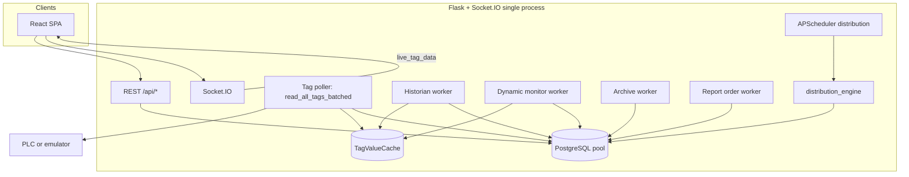

# Backend architecture — Reporting Module (Hercules)

This document describes the **Python/Flask backend**: how data moves from the PLC into PostgreSQL, how **real-time** updates reach the UI, how **REST APIs** are organized by feature, and how the design behaves under load. It is intended as the single high-level reference for developers and operators.

**Scope:** `backend/` application server, workers, shared utilities, SQL migrations, and how they connect to the React frontend and desktop launcher. It does not replace per-feature specs in `docs/` but indexes them.

---

## Table of contents

1. [Purpose and high-level picture](#1-purpose-and-high-level-picture)
2. [Entry points and processes](#2-entry-points-and-processes)
3. [Technology stack](#3-technology-stack)
4. [Backend directory map](#4-backend-directory-map)
5. [Architecture diagrams](#5-architecture-diagrams)
6. [HTTP layer: CORS, sessions, errors](#6-http-layer-cors-sessions-errors)
7. [Database: pooling, migrations, schema themes](#7-database-pooling-migrations-schema-themes)
8. [PLC and tag ingestion](#8-plc-and-tag-ingestion)
9. [In-memory TagValueCache and poller](#9-in-memory-tagvaluecache-and-poller)
10. [Background workers (eventlet)](#10-background-workers-eventlet)
11. [Real-time: Socket.IO](#11-real-time-socketio)
12. [REST polling vs WebSocket (frontend contract)](#12-rest-polling-vs-websocket-frontend-contract)
13. [API surface by blueprint](#13-api-surface-by-blueprint)
14. [Settings routes on `app.py`](#14-settings-routes-on-apppy)
15. [Authentication and users](#15-authentication-and-users)
16. [Report distribution and scheduler](#16-report-distribution-and-scheduler)
17. [Hercules AI subsystem](#17-hercules-ai-subsystem)
18. [Orders, job logs, and templates](#18-orders-job-logs-and-templates)
19. [Desktop / PyInstaller](#19-desktop--pyinstaller)
20. [Environment variables (common)](#20-environment-variables-common)
21. [Scalability and limits](#21-scalability-and-limits)
22. [Tests and quality](#22-tests-and-quality)
23. [Related documentation](#23-related-documentation)

---

## 1. Purpose and high-level picture

The backend is a **single Flask process** that:

- Serves the **built React SPA** and **JSON APIs** under `/api/...`.
- Maintains **Flask-Login** sessions for operators and admins.
- Connects to **PostgreSQL** through a **threaded connection pool**.
- Reads industrial tags from a **Siemens PLC** (or **demo emulator**) and exposes values to the UI.
- Persists **high-frequency time-series** (`tag_history`), **hourly rollups** (`tag_history_archive`), and **per-layout live monitor** snapshots (dynamic tables / JSONB).
- Pushes **live tag values** and optional **system logs** to browsers via **Flask-SocketIO** (eventlet).
- Runs **greenlet workers** for historian, dynamic monitor, archive rollup, and report-order tracking.
- Runs **APScheduler** jobs for **report distribution** rules stored in the database.

---

## 2. Entry points and processes

| Entry | Role |
|--------|------|
| **`backend/app.py`** | Main Flask app: blueprints, settings routes, auth, static SPA, Socket.IO wiring, starts workers when the module loads. |
| **`backend/desktop_entry.py`** | Desktop / PyInstaller: sets `HERCULES_DESKTOP=1`, file logging under `%APPDATA%/Hercules/logs`, copies default configs, starts scheduler, runs `socketio.run()`. |
| **`backend/init_db.py`** | Standalone DB bootstrap (no Flask import): creates DB if needed, runs ordered SQL from `backend/migrations/`. Used by installer / wizard. |
| **`launcher.py`** (repo root) | Dev-style launcher for combined frontend/backend workflows (see repo README / usage). |

Production-like runs typically execute **`app.py`** or **`desktop_entry.py`**, both of which import **`app`** and therefore trigger **eventlet monkey patching** and **worker startup** at import time.

---

## 3. Technology stack

| Concern | Implementation |
|---------|----------------|
| Web | **Flask** |
| Real-time | **Flask-SocketIO**, **`async_mode='eventlet'`** |
| Concurrency | **eventlet** greenlets (`eventlet.spawn`), optional **thread** in tag poller |
| DB driver | **psycopg2** + **`ThreadedConnectionPool`** (min 5, max 20) + `PooledConnection` wrapper |
| DB | **PostgreSQL** |
| PLC | **python-snap7** (`plc_utils`, `utils/tag_reader.py`); demo uses emulator paths in `plc_data_source` / `demo_mode` |
| Scheduled jobs | **APScheduler** (`scheduler.py`) for distribution cron rebuild |
| AI | **hercules_ai_bp** + **`ai_provider.py`** (Anthropic cloud / OpenAI-compatible local LM Studio) |
| Auth | **Flask-Login**, password hashing via **werkzeug** |

---

## 4. Backend directory map

| Path | Purpose |
|------|---------|
| `app.py` | Flask app, Socket.IO, pool, many `/api/settings/*` routes, login, SPA catch-all, worker spawn. |
| `*_bp.py` | Feature **blueprints** (mounted under `/api` unless noted). |
| `workers/` | Long-running **eventlet** loops: historian, dynamic monitor, archive, report order. |
| `utils/` | Tag reading, cache, KPI engine, layout tags, historian helpers, dynamic DDL helpers, etc. |
| `migrations/` | Versioned **SQL** applied by `init_db.py` and startup migration runner in `app.py`. |
| `tests/` | Pytest unit tests (e.g. tag cache, batch reads). |
| `tools/setup/`, `tools/migrations/` | Seeds and one-off migration scripts. |
| `distribution_engine.py` | Large engine: render reports, PDF/Excel, email, AI summaries, execution logging. |
| `scheduler.py` | Builds APScheduler cron jobs from `distribution_rules`. |
| `smtp_config.py`, `shifts_config.py`, `plc_config.py`, `demo_mode.py` | File or DB-backed configuration helpers. |
| `desktop_entry.py`, `pyinstaller_runtime_hook.py` | Frozen executable integration. |

---

## 5. Architecture diagrams

### 5.1 Data and control flow (simplified)

### 5.2 Read-once, share-many (tag values)

One **poller** updates **TagValueCache** ~1 Hz using **batched** PLC reads. The **historian**, **dynamic monitor worker**, and **`dynamic_tag_realtime_monitor`** (WebSocket) **read the cache**, avoiding three independent full PLC scan loops.

---

## 6. HTTP layer: CORS, sessions, errors

- **CORS:** `before_request` / `after_request` handlers allow credentialed cross-origin requests when `Origin` matches an allowlist (explicit hosts + private IP regex). Preflight **OPTIONS** is handled for API routes.
- **Sessions:** `SESSION_COOKIE_SECURE` and `SESSION_COOKIE_SAMESITE` are driven by environment (HTTP dev vs HTTPS production).
- **Errors:** `handle_db_errors` and `_error_response` centralize JSON errors; **`detail`** is included only when **`DEV_MODE`** or `FLASK_ENV=development`.

---

## 7. Database: pooling, migrations, schema themes

### 7.1 Connection pool

`get_db_connection()` prefers **`ThreadedConnectionPool`** (5–20 connections). Connections are wrapped so **`close()`** returns the connection to the pool. On pool exhaustion, a **direct** `psycopg2.connect` fallback may be used.

### 7.2 Migrations

`init_db.py` defines **`MIGRATION_ORDER`**: ordered SQL files creating tags, users, bins/materials, report builder, **tag_history**, KPI engine, dynamic monitoring, licenses, mappings, distribution, archive granularity, execution logs, AI tables, distribution AI fields, order tracking on templates, etc.

`app.py` also runs a **startup migration** pass over `backend/migrations` when appropriate for dev / packaged layouts.

### 7.3 Schema themes (logical, not every column)

| Theme | Tables / objects (representative) |
|--------|-----------------------------------|
| Identity | `users`, roles, password hashes |
| Tags | `tags`, tag metadata, formulas, counters, bin activation |
| Live monitor | `live_monitor_layouts`, sections, columns, KPI cards, `dynamic_monitor_registry`, per-layout `*_monitor_logs` |
| Historian | `tag_history` (raw samples), `tag_history_archive` (hourly / rollup) |
| KPI | KPI config tables consumed by `kpi_config_bp` and `kpi_engine` |
| Report builder | Templates, layout JSON, publish state |
| Mappings | `mappings` and resolve API |
| Distribution | `distribution_rules`, execution logs |
| AI | `hercules_ai_*` config, profiles, scan results |
| Licensing | `licenses`, machine binding fields |

---

## 8. PLC and tag ingestion

- **`utils/tag_reader.py`**: low-level decode (BOOL/INT/DINT/REAL/STRING), **value_formula** via **asteval**, scaling, demo manual tag synthesis.
- **`read_all_tags()`**: loads tag definitions from DB, connects PLC, reads tags (used by **REST** live monitor and some tools).
- **`read_all_tags_batched()`**: **groups reads by DB number**, caches tag configs briefly — used by the **central poller** to minimize snap7 round-trips.
- **`plc_utils.py`**: connection helpers, shared reconnect on PLC config change.
- **`plc_config.py` / `demo_mode.py`**: operator-facing behavior for live vs demo.

---

## 9. In-memory TagValueCache and poller

- **`utils/tag_value_cache.py`**: thread-safe singleton **`TagValueCache`** (max age ~3 s for “fresh” reads).
- **`start_tag_poller()`**: loop calling **`read_all_tags_batched`**, then **`cache.update()`**; uses **eventlet.sleep** for pacing and backoff on errors.

Workers and WebSocket broadcaster call **`get_tag_value_cache().get_values()`**.

---

## 10. Background workers (eventlet)

Spawn order (see `backend/app.py` after Socket.IO setup):

1. **Tag poller** — fills `TagValueCache`.
2. **`dynamic_tag_realtime_monitor`** — emits **`live_tag_data`** ~1 Hz from cache (no direct PLC read).
3. **`historian_worker`** — reads cache, **`execute_values`** bulk insert into **`tag_history`** with **`pg_try_advisory_xact_lock`** to avoid duplicate writers per tick; supports **`USE_CENTRAL_HISTORIAN`**; counter deltas.
4. **`dynamic_monitor_worker`** — for each **published** layout: uses cache, resolves section/KPI data, writes per-second monitor rows; **caches layout config and tag maps** (~30 s TTL); **`DynamicOrderTracker`** for order start/stop.
5. **`dynamic_archive_worker`** — hourly aggregation of universal historian rows into **`tag_history_archive`**, idempotent inserts, **retention prune** for raw universal rows (`TAG_HISTORY_RAW_RETENTION_DAYS`), plus per-layout archive logic as implemented in the worker.
6. **`report_order_worker`** — **Job logs** / order tracking driven from **report builder templates** configuration.

---

## 11. Real-time: Socket.IO

### 11.1 Default namespace — live PLC tags

- Loop: **`dynamic_tag_realtime_monitor`** in `app.py`.
- Event: **`live_tag_data`**
- Payload: `{ timestamp, tag_values, plc_connected }` or `{ error, plc_connected: false, timestamp }`.

### 11.2 `/logs` namespace — system logs

- Logging handler **`_SocketIOLogHandler`** forwards records as **`system_log`** when subscribers > 0.
- REST fallback: **`GET /api/settings/logs/recent`** (ring buffer, last N entries).

### 11.3 Client transport

Frontend uses **`socket.io-client`** with WebSocket transport and credentials (`Frontend/src/Context/SocketContext.jsx`).

---

## 12. REST polling vs WebSocket (frontend contract)

Live report views typically:

- Subscribe to **`live_tag_data`** for ~1 s updates from the **cache-backed** broadcaster.
- Poll **`GET /api/live-monitor/tags`** on a timer (often **5 s**) for resilience and initial hydration.

**Important:** `live_monitor_bp.get_live_tag_values` uses **`read_all_tags()`**, which issues a **separate PLC read path**, not the in-memory cache. Heavy polling increases PLC load relative to the WebSocket path.

---

## 13. API surface by blueprint

All blueprints below are registered with **`url_prefix='/api'`** in `app.py`.

### 13.1 `tags_bp` — `/api/tags...`

| Method | Path | Purpose (summary) |
|--------|------|-------------------|
| GET | `/tags` | List tags (filters). |
| POST | `/tags` | Create tag. |
| POST | `/tags/get-values` | Batch read values. |
| GET/PUT/DELETE | `/tags/<tag_name>` | CRUD by name. |
| POST | `/tags/bulk-delete` | Bulk delete. |
| GET | `/tags/<tag_name>/test` | Test read. |
| POST | `/tags/bulk-import`, `/tags/import-plc-csv`, `/tags/import-plc-excel` | Imports. |
| GET | `/tags/export`, `/tags/export-csv` | Exports. |
| POST | `/tags/seed` | Seed data. |
| POST | `/tags/generate-report-drafts` | Draft generation helper. |

### 13.2 `tag_groups_bp` — `/api/tag-groups...`

CRUD for **tag groups** and membership (`/tag-groups/<id>/tags`).

### 13.3 `live_monitor_bp` — `/api/live-monitor...`

| Method | Path | Purpose |
|--------|------|---------|
| GET | `/live-monitor/predefined` | Fallback predefined report / emulator offsets. |
| GET | `/live-monitor/tags` | Live tag values (PLC via `read_all_tags`). |
| GET/POST | `/live-monitor/layouts` | List / create layouts. |
| GET/PUT/DELETE | `/live-monitor/layouts/<id>` | Layout CRUD. |
| POST | `/live-monitor/layouts/<id>/sections` | Add section. |
| POST | `/live-monitor/sections/<id>/columns` | Add column. |
| POST | `/live-monitor/sections/<id>/kpi-cards` | Add KPI card. |
| GET/PUT | `/live-monitor/layouts/<id>/config` | Layout JSON config. |
| POST | `/live-monitor/layouts/<id>/publish` | Publish for live monitor. |
| POST | `/live-monitor/layouts/<id>/unpublish` | Unpublish. |

Publishing interacts with **`dynamic_monitor_worker`** registry and dynamic tables utilities.

### 13.4 `historian_bp` — `/api/historian...`

| Method | Path | Purpose |
|--------|------|---------|
| GET | `/historian/history` | Raw per-sample history (layout-scoped compat). |
| GET | `/historian/archive` | Hourly archive rows. |
| GET | `/historian/by-tags` | Query by tag names (Report Builder). |
| GET | `/historian/time-series` | Chart arrays with **auto-downsampling**. |

Feature flag: **`REPORT_USE_HISTORIAN`** (and query/header overrides).

### 13.5 `kpi_config_bp` — `/api/kpi-config...`

CRUD for KPI definitions; **`/kpi-config/values`** and **`/kpi-config/values/historical`** for computed or stored values.

### 13.6 `report_builder_bp` — `/api/report-builder...`

Templates CRUD, duplicate, export JSON.

### 13.7 `mappings_bp` — `/api/mappings...`

CRUD, toggle, **`/mappings/resolve`** for display resolution, migrate-from-local.

### 13.8 `license_bp` — `/api/license...`, `/api/admin/licenses...`

Registration, status, admin license management (PATCH/DELETE).

### 13.9 `branding_bp` — `/api/settings/client-logo`

GET/POST/DELETE client logo (binary upload).

### 13.10 `distribution_bp` — `/api/distribution...`

| Method | Path | Purpose |
|--------|------|---------|
| GET/POST | `/distribution/rules` | List / create rules. |
| PUT/DELETE | `/distribution/rules/<id>` | Update / delete. |
| POST | `/distribution/rules/<id>/run` | Manual run. |
| GET | `/distribution/rules/<id>/log` | Execution log. |
| GET | `/distribution/browse-folders` | Folder picker helper. |

### 13.11 `updates_bp` — `/api/settings/version`, `/api/settings/updates/check`

Application version and update check metadata for clients.

### 13.12 `hercules_ai_bp` — `/api/hercules-ai...`

Scan, profiles (bulk PUT/DELETE), config, status, preview summary, insights, preview charts, chart-data, test-connection. Backed by **`ai_provider.py`**, **`ai_prompts.py`**, KPI/chart helpers.

### 13.13 `orders_report_bp` — `/api/orders...`

Layouts list, jobs list, job detail, layout-tags for a template — supports **Job Logs** UI.

---

## 14. Settings routes on `app.py`

These are **not** in a blueprint; they live on `app` under `/api/settings/...` or related:

| Area | Routes (representative) |
|------|-------------------------|
| Demo | `GET/POST /api/settings/demo-mode` |
| PLC | `GET/POST /api/settings/plc-config` |
| Email | `GET/POST /api/settings/smtp-config`, `POST /api/settings/smtp-test` |
| Shifts | `GET/POST /api/settings/shifts` |
| Status | `GET /api/settings/system-status` |
| Emulator | `GET /api/settings/emulator-offsets`, custom offsets CRUD |
| Network | `GET /api/settings/network-info` |
| Logs | `GET /api/settings/system-logs` (file tail), `GET /api/settings/logs/recent` (ring buffer) |
| Retention | `GET/POST /api/settings/data-retention`, `GET /api/settings/export-archive` |

Many require **`@login_required`**; retention and system log file access require **admin/superadmin** roles.

---

## 15. Authentication and users

- **Flask-Login** `LoginManager`, session cookie auth.
- Routes: **`POST /login`**, **`POST /logout`**, **`GET /check-auth`**.
- User admin: **`GET /users`**, **`POST /add-user`**, **`DELETE /delete-user/<id>`**, **`PUT /update-user/<id>`**, password change routes.
- **`require_role`** decorator for superadmin-only or role-limited operations.

---

## 16. Report distribution and scheduler

- **`scheduler.start_scheduler()`** (called from app startup path): **BackgroundScheduler** loads **`distribution_rules`**, attaches **CronTrigger** jobs, **`rebuild_scheduler_jobs()`** on rule CRUD from **`distribution_bp`**.
- **`distribution_engine.execute_distribution_rule`** performs the heavy work: time windows, templates, attachments, SMTP/Resend, optional **AI summary** fields, execution logging.

---

## 17. Hercules AI subsystem

- **Configuration** stored in DB (provider: **cloud** vs **local**, model, API keys).
- **`ai_provider.generate`**: routes to **Anthropic** (Claude) or **OpenAI-compatible** local base URL (LM Studio).
- **Features**: data scan, narrative insights, chart suggestions, preview endpoints used by the frontend wizard.

Secrets are managed through the AI config API; operators should follow normal secret hygiene.

---

## 18. Orders, job logs, and templates

- **Report builder templates** can carry **order tracking** configuration (migrations added order fields).
- **`report_order_worker`** monitors PLC/template-driven order state and persists job metadata for the **Orders** / **Job Logs** experience.
- **`orders_report_bp`** exposes read APIs for layouts, jobs, and per-job details.

---

## 19. Desktop / PyInstaller

- **`desktop_entry.py`**: no Flask import until after UTF-8 and logging setup; imports **`app`** and **`socketio`**, starts **`start_scheduler()`**, optional secondary license check, binds **Socket.IO** server (see file for host/port).
- **`init_db.py`**: safe for installer to run **before** backend starts.
- Log rotation: **`RotatingFileHandler`** to `%APPDATA%/Hercules/logs/hercules.log` on Windows.

---

## 20. Environment variables (common)

| Variable | Typical use |
|----------|-------------|
| `POSTGRES_DB`, `POSTGRES_USER`, `POSTGRES_PASSWORD`, `DB_HOST`, `DB_PORT` | Database connection |
| `FLASK_SECRET_KEY` | Session signing |
| `SESSION_COOKIE_SECURE`, `SESSION_COOKIE_SAMESITE` | Cookie policy |
| `FLASK_ENV`, `DEV_MODE` | Debug routes and verbose errors |
| `USE_CENTRAL_HISTORIAN` | Enable/disable universal historian worker |
| `REPORT_USE_HISTORIAN` | Prefer historian APIs for reports |
| `TAG_HISTORY_RAW_RETENTION_DAYS` | Prune raw universal `tag_history` after N days (`0` = disable prune) |
| `TAG_ARCHIVE_RETENTION_DAYS`, `TAG_ARCHIVE_ROLLUP` | Archive retention / rollup (also persisted via `system_settings` in archive worker) |
| `HERCULES_DESKTOP` | Set by desktop entry for desktop-specific behavior |

(Additional keys appear in distribution, AI, and SMTP modules — search `os.getenv` / `os.environ` per feature.)

---

## 21. Scalability and limits

**Strengths**

- Single **batched** PLC poll per second for cache consumers.
- **Bulk inserts** (`execute_values`) and **advisory locks** for historian.
- **Hourly archive** + **retention** to cap raw table growth.
- **Downsampled** historian time-series API for charts.

**Limits (current design)**

- **One primary Socket.IO + Flask process**; horizontal scale-out for websockets is not built-in (no Redis adapter / sticky sessions in repo).
- **Pool max 20** — many concurrent long queries can still queue.
- **Broadcast** `live_tag_data` sends the **full tag map** to every client every tick — CPU and bandwidth scale with tag count × clients.
- REST **`/live-monitor/tags`** duplicates PLC I/O vs cache path if overused.

For plant-scale single server deployments, tune **PostgreSQL** (disk, indexes, autovacuum), **retention**, **tag count**, and **client count**.

---

## 22. Tests and quality

- **`backend/tests/`**: e.g. **`test_tag_value_cache.py`**, **`test_batch_reads.py`** — run with pytest from repo root / `backend` as configured in your workflow.

---

## 23. Related documentation

| Document | Topic |
|----------|--------|
| `docs/10-LIVE-MONITORING.md` | Live monitor UX and data flow (note: diagrams may predate full TagValueCache wording; trust this architecture doc for poller/cache). |
| `docs/reference/API-ENDPOINTS.md` | Endpoint and WebSocket reference. |
| `docs/plan/16-REPORT-DISTRIBUTION.md` | Distribution product plan. |
| `docs/plan/JOB_LOGS_AND_HISTORIAN_TIME_CHANGES.md` | Job logs and historian behavior notes. |

---

## Document history

| Date | Change |
|------|--------|
| 2026-04-24 | Initial full backend architecture doc added under `docs/BACKEND-ARCHITECTURE.md`. |
